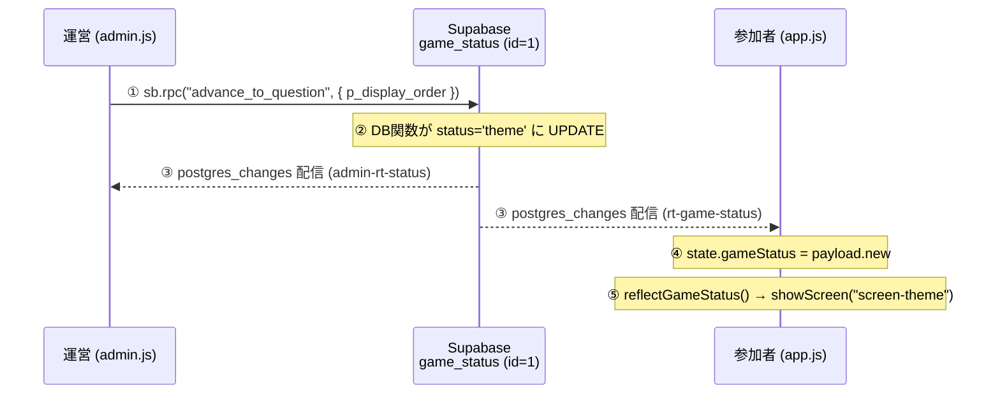

# パーセント・ローズ（PERCENT ROSE）

社内イベント（納会2次会）向け・2人1組のリアルタイム参加型「割合あてクイズ」ミニアプリ。
`LINEミニアプリ (LIFF)` ＋ `GitHub Pages` ＋ `Supabase` の完全サーバーレス構成。

このドキュメントは本リポジトリのマスター仕様書 兼 取扱説明書です。記述はすべて実際のソースコード（`public/js/*.js` と `sql/*.sql`）の挙動を正としています。数ヶ月後に見返しても、企画・仕様・コードの挙動・運用手順がこれ一冊で完結することを目的にしています。

---

## 目次

1. [プロジェクト概要 & ゲームルール](#1-プロジェクト概要--ゲームルール)
2. [システムアーキテクチャ](#2-システムアーキテクチャ)
3. [ゲームステータスと画面遷移](#3-ゲームステータスと画面遷移実コードベース)
4. [コアロジックのデータ処理](#4-コアロジックのデータ処理実コードベース)
5. [データベース設計](#5-データベース設計実際の構成)
6. [ディレクトリ構造とファイルの役割](#6-ディレクトリ構造とファイルの役割)
7. [環境設定（config.js の仕様）](#7-環境設定configjs-の仕様)
8. [開発・運用の手順マニュアル](#8-開発運用の手順マニュアル)

---

## 1. プロジェクト概要 & ゲームルール

### 企画目的

社内イベント（納会の2次会コンテンツ）で、参加者を2人1組のペアに分けて盛り上がるための参加型クイズです。
全員が自分のスマホのLINEからアクセスし、運営は会場のスクリーン横で管理画面のボタン操作だけで進行を一斉にコントロールします。

`public/index.html` の見出しがそのまま企画を表しています。

```html
<h1 class="logo"><span class="small">納会2次会 コンテンツ</span>PERCENT<br />ROSE</h1>
<p class="lead">2人1組で挑戦！<br />まずはペアの名前を決めよう！</p>
...
<span class="note">※ ペアの代表者1名がこの画面を操作してください。</span>
```

### ゲームのルール（実装挙動ベース）

出題されるのは「世の中の◯◯は何％？」という割合あてクイズ。各ペアは 0〜100% のスライダーで1問につき1回だけ回答します。

| ルール | 実装上の根拠 |
| :--- | :--- |
| 各ペアはバラを100本持ってスタート | `users.total_roses` の `DEFAULT 100`（`01_schema.sql`） |
| 1問につき回答は1回のみ（一発勝負） | `answers_log` の主キー `(line_user_id, question_id)` ＋ `submit_answer` が `INSERT` のみ |
| 正解との誤差（絶対値）ぶんだけバラが没収される | `reveal_answer` 内 `total_roses = GREATEST(0, total_roses - deviation)` |
| 未回答だったペアは強制脱落（バラ0本） | `reveal_answer` 内 未回答者を `total_roses = 0` に |
| バラは0本が下限（マイナスにはならない） | `GREATEST(0, ...)` ＋ テーブル制約 `total_roses BETWEEN 0 AND 100` |
| 練習問題（1問目）はスコアに影響しない | `display_order = 0` の問題は減算・脱落をスキップ |
| 勝利条件 = 最後に残ったバラの本数が多い順 | `final_result` でバラ残数の降順ランキング。同数のペアは同順位（例：2組が2位→次は4位）。0本のペアは「脱落」扱いで、順位付きランキングとは別セクションに一覧表示 |

演出面では、誤差ぶんのバラを奪っていく「お花没収おじさん」（`images/ojisan_take.png`）が登場し、残数に応じて花束画像（`rose_100/75/50/25/0.png`）が切り替わります。没収の瞬間にバラ粒子がおじさんに吸い込まれ、残数がカウントダウンするアニメーションが `app.js` に実装されています。

### 1ゲームの流れ

```
[entry]  全ペアがペア名でエントリー
   │       └─ 運営が「問題を表示する」を押す
   ▼
[theme]  問題を表示・回答受付（スライダーで回答）
   │       └─ 運営が「正解を表示する」を押す（＝締切＋誤差ぶん没収を確定）
   ▼
[answer] 正解発表 → おじさん登場 → バラ没収演出
   │       └─ 運営が「次の問題へ」（最終問題まで [theme]↔[answer] を繰り返し）
   ▼
[answer] 最終問題のあと、運営が「最終結果へ」を押す
   ▼
[final_result] ランキング発表（クリア組を順位付きで表示 ＋ 脱落組を別セクションに一覧表示）
```

---

## 2. システムアーキテクチャ

サーバープログラム（自前のバックエンド）は存在しません。下記3要素だけで完結します。

| 要素 | 役割 | 実体 |
| :--- | :--- | :--- |
| LINEミニアプリ（LIFF） | 参加者の本人識別。LINEの `userId` を `line_user_id` として取得 | `public/index.html` + `js/app.js` |
| GitHub Pages | フロントエンド（HTML/CSS/JS）を静的配信 | `public/` ディレクトリ全体 |
| Supabase（PostgreSQL） | 唯一の「真実の源」。状態・回答・残高を保持し、変更を Realtime で全端末へ即時配信 | `sql/` で定義 |

```
   参加者（LINEアプリ内）              運営（通常のブラウザ）
   ┌────────────────┐              ┌────────────────┐
   │  index.html    │              │  admin.html    │
   │   + app.js     │              │   + admin.js   │
   │  （LIFFで本人確認）│              │  （LIFF不要）    │
   └───────┬────────┘              └───────┬────────┘
           │                               │
           │  ① RPC呼び出し（書き込み）        │
           │  ② SELECT（読み取り）            │
           │  ③ Realtime購読（変更の受信）     │
           └───────────────┬───────────────┘
                           ▼
              ┌──────────────────────────┐
              │      Supabase (Postgres)   │
              │  ┌──────────────────────┐  │
              │  │ game_status / users  │  │ ← Realtime配信対象
              │  │ questions / answers_log│ │
              │  └──────────────────────┘  │
              │  RPC関数（SECURITY DEFINER）  │ ← 全ての書き込みはここ経由
              └──────────────────────────┘
```

設計の肝：フロントは「①RPCを呼ぶ・②テーブルをSELECTする・③Realtimeで変更を受け取る」だけ。ゲームのルール（誤差計算・減算・脱落判定）はすべて Supabase 側の DB 関数に閉じ込め、正解値はクライアントへ一切渡しません（[第4章](#4-コアロジックのデータ処理実コードベース)・[第5章](#5-データベース設計実際の構成)参照）。

---

## 3. ゲームステータスと画面遷移（実コードベース）

進行状態は `game_status` テーブルのシングルトン1行（`id = 1`）の `status` カラムだけで表現されます。
`status` は次の4値に制約されています（`01_schema.sql`）。

```sql
status text NOT NULL CHECK (status IN ('entry','theme','answer','final_result'))
```

### ステータス → 画面の対応表

| `status` | 意味 | 参加者画面（`app.js` / `index.html`） | 運営画面（`admin.js` / `admin.html`） |
| :--- | :--- | :--- | :--- |
| `entry` | エントリー受付中 | `#screen-waiting`（未登録なら `#screen-entry`） | `#admin-view-entry`（「エントリー受付中です」＋エントリー数） |
| `theme` | 出題中・回答受付 | `#screen-theme`（ステータスバー＋問題文＋スライダー）／回答済みなら `#screen-submitted` | `#admin-view-theme`（問題文＋回答済み数／総数） |
| `answer` | 正解発表＋没収演出 | `#screen-answer`（ステータスバー＋正解→おじさん→没収アニメ → 完了後に下部固定フッターで待機案内） | `#admin-view-answer`（正解値＋「次の問題へ」/「最終結果へ」） |
| `final_result` | 最終ランキング | `#screen-result`（自分の順位＋クリア組ランキング＋脱落組一覧＋残数で分岐するおじさん演出） | `#admin-view-result`（クリア組ランキング＋脱落組一覧） |

`#screen-theme` / `#screen-submitted` / `#screen-answer` の3画面共通で、上部に「ステータスバー」（`.status-bar`）を表示します（詳細は4-5節）。

どちらの画面も「`status` を見て対応するセクションの `hidden` クラスを外す」という同じ描画モデルです。

```js
// app.js — 参加者画面の切り替え
function showScreen(id) {
  document.querySelectorAll(".screen").forEach((el) => el.classList.add("hidden"));
  $("#" + id).classList.remove("hidden");
}
```

```js
// admin.js — 運営画面の切り替え
function showView(name) {
  document.querySelectorAll(".admin-view").forEach((el) => el.classList.add("hidden"));
  const el = $("#admin-view-" + name);
  if (el) el.classList.remove("hidden");
}
```

### 未登録ペアの特別扱い（参加者画面）

`status` が `entry` 以外でも、`app.js` は「自分が `users` に登録されているか」を毎回 `refreshUser()` で確認します。
登録が無ければ（未エントリー、またはリセットで削除された）強制的に `#screen-entry`（ペア名入力）へ戻します。

```js
// app.js reflectGameStatus()（抜粋）
if (gs.status !== "answer") { await refreshUser(); }   // DBと残高・登録状況を同期
if (!state.pairName) { showScreen("screen-entry"); return; }  // 未登録ならエントリーへ
```

---

## 4. コアロジックのデータ処理（実コードベース）

### 4-1. リアルタイム同期：運営操作が全端末へ伝播する仕組み

運営のボタン操作から全参加者の画面遷移までは、「RPCで書き込む → Realtimeで読み出す」の一方通行です。



① 書き込み（`admin.js`） — 進行ボタンは必ず確認ダイアログを挟んでから RPC を呼びます。

```js
// admin.js — 「問題を表示する」
async function onStart() {
  const ok = await confirmDialog("クイズを開始します。\n全員の画面が「出題」に切り替わります。よろしいですか？");
  if (!ok) return;
  const first = state.questions[0];
  const { error } = await sb.rpc("advance_to_question", { p_display_order: first.display_order });
  if (error) { console.error(error); toast("開始に失敗しました"); }
}
```

② 受信（`app.js`／`admin.js`） — `game_status` の変更を購読し、受け取った行で再描画します。

```js
// app.js — Realtime 購読
sb.channel("rt-game-status")
  .on("postgres_changes",
    { event: "*", schema: "public", table: "game_status" },
    async (payload) => {
      state.gameStatus = payload.new;
      if (state.gameStatus.status !== "answer") { /* 演出状態をリセット */ }
      await reflectGameStatus();   // ← ここで画面遷移
    })
  .subscribe();
```

Realtime が成立する前提として、配信対象テーブルを明示登録しています（`01_schema.sql`）。

```sql
ALTER PUBLICATION supabase_realtime ADD TABLE public.game_status;  -- 進行状態
ALTER PUBLICATION supabase_realtime ADD TABLE public.users;        -- バラ残数（没収アニメ用）
```

補助的な購読

| 画面 | チャンネル | 購読対象 | 用途 |
| :--- | :--- | :--- | :--- |
| 参加者 | `rt-users-self` | `users`（自分の行のみ `filter: line_user_id=eq.…`） | `total_roses` の変化をバッジへ反映・没収アニメ起動 |
| 運営 | `admin-rt-counts` | `users` ＋ `answers_log` | 「エントリー数」「回答済み数」をライブ更新 |

### 4-2. 回答受付：`submit_answer()`（`02_functions.sql`）

参加者が「この数字で回答する」を押すと `sb.rpc("submit_answer", …)` が呼ばれ、DB側で以下を実行します。

1. 入力チェック — `user_answer` が 0〜100 か。
2. 受付ガード — `game_status.status = 'theme'` かつ `current_question_id` が一致するときのみ受付（締切後・別問題への遅延送信を拒否）。
3. 誤差をサーバー側で計算 — `v_deviation := abs(correct_value - user_answer)`。正解値はクライアントへ渡さない。
4. 一発勝負の担保 — `answers_log` への `INSERT` のみ（UPSERTにしない）。主キー重複を捕まえて専用エラーに変換。

```sql
-- submit_answer 抜粋：重複ガードと誤差計算
v_deviation := abs(v_correct - p_user_answer);
BEGIN
  INSERT INTO public.answers_log (line_user_id, question_id, user_answer, deviation)
  VALUES (p_line_user_id, p_question_id, p_user_answer, v_deviation);
EXCEPTION
  WHEN unique_violation      THEN RAISE EXCEPTION 'already_answered'     USING ERRCODE = 'P0001';
  WHEN foreign_key_violation THEN RAISE EXCEPTION 'user_not_registered' USING ERRCODE = 'P0001';
END;
```

フロント（`app.js`）も `state.submittedQId` と `sessionStorage`（`pr_answer_<qid>`）で二重送信を抑止し、リロードしても回答済み画面を復元します。ただし最終的な担保はDBの主キー制約です。`already_answered` が返った場合は、直前に入力した値ではなく `fetchRecordedAnswer()` で `answers_log` から実際に記録されている回答を取得し直して回答済み画面へ遷移します（表示上の回答/誤差がサーバー確定値とズレないようにするため）。

**LINEミニアプリを閉じた場合の挙動**：本人確認は `liff.getProfile().userId` によるためLINEアプリを閉じて開き直しても同じペアとして復帰し、送信済みの回答もDBの主キー制約により失われたり二重になったりしません。ただし「回答済みかどうか」の画面復元は `sessionStorage` を先に見るため、LINEアプリが完全終了して `sessionStorage` が消えた状態で同じ問題がまだ受付中のうちに開き直すと、`reflectGameStatus()` の `theme` 分岐が `sessionStorage` に無ければ `fetchRecordedAnswer()` で `answers_log` を直接確認し、記録済みの回答があれば `#screen-submitted` へ復元します（未回答なら通常通りスライダー画面）。正解発表画面（`runAnswerSequence()`）も同様に `answers_log` を直接参照するフォールバックを持つため、いずれの画面でも表示される回答・誤差・残数は常にDBの確定値と一致します。

### 4-3. バラ減算：`reveal_answer()`（`02_functions.sql`）

運営が「正解を表示する」を押すと `sb.rpc("reveal_answer")` が走り、1トランザクションで没収処理一式を実行します。

| 手順 | 処理 | 対象 |
| :--- | :--- | :--- |
| B-1-c | 未回答ペアにも履歴を残す：`answers_log` に `user_answer = NULL, deviation = 100` を補完INSERT | 練習・本番 両方 |
| B-1-b | 未回答ペアを強制脱落：`total_roses = 0` | 本番のみ（`display_order ≠ 0`） |
| B-2,3 | 回答ペアの誤差ぶん減算：`GREATEST(0, total_roses - deviation)`（既に0本ならスキップ） | 本番のみ・`total_roses > 0` |
| B-4 | `status = 'answer'` に遷移し `revealed_correct_value` に正解をセット（ここで初めて正解公開） | 全体 |

```sql
-- reveal_answer 抜粋
v_is_test := (v_display_order = 0);   -- ★ 練習問題（display_order=0）の判定

-- B-1-b: 未回答者を強制脱落（本番のみ）
IF NOT v_is_test THEN
  UPDATE public.users u SET total_roses = 0
    FROM public.answers_log a
   WHERE a.line_user_id = u.line_user_id AND a.question_id = v_question_id
     AND a.user_answer IS NULL;
END IF;

-- B-2,3: 回答者の誤差減算（本番のみ・下限0・既0スキップ）
IF NOT v_is_test THEN
  UPDATE public.users u SET total_roses = GREATEST(0, u.total_roses - a.deviation)  -- ← 下限0クランプ
    FROM public.answers_log a
   WHERE a.line_user_id = u.line_user_id AND a.question_id = v_question_id
     AND a.user_answer IS NOT NULL
     AND u.total_roses > 0;                                                          -- ← 既に脱落(0)は触らない
END IF;
```

練習問題（`display_order = 0`）の特別扱い：履歴（B-1-c）だけは残し、`total_roses` への減算・脱落は一切行いません。
`app.js` 側でも練習問題では「画面表示だけ減らすデモ演出」を行い、内部状態 `state.totalRoses` は DB の本来値（=100）へ同期し直します。本番スコアを汚さずに操作リハーサルができる設計です。

`total_roses` が変わると `users` のRealtime変更が `rt-users-self` に届き、`app.js` の `runAnswerSequence()` が正解表示 → おじさん登場 → バラ粒子の吸い取り → 残数カウントダウンの演出を再生します（未回答ペアには「未回答は全部没収しちゃうよー。」のメッセージ）。

待機案内の固定フッター：上記の演出（正解表示→おじさん登場→没収カウントダウン＋画面シェイク）が完全に終了したタイミングで、画面最下部に固定フッター（`#wait-footer`：左にローディングサークル／右に「次の画面までそのままお待ちください」）がフェードイン表示されます。従来バラ残数カード内にあった「次の画面まで…」の待機文言は、視認性向上のためこのフッターへ移設しました。フッターは `showScreen()` で画面遷移のたびに必ず非表示化されます。

### 4-4. その他の進行RPC

| 関数 | 呼び出し元ボタン | 効果 |
| :--- | :--- | :--- |
| `register_user(p_line_user_id, p_pair_name)` | 「エントリーして待機する」 | ペア登録。起動だけでは登録しない（ゴーストユーザー対策）。再エントリーは `pair_name` を上書き。8文字超は `pair_name_too_long` エラー |
| `advance_to_question(p_display_order)` | 「問題を表示する」「次の問題へ」 | 指定問題をアクティブ化 → `status='theme'`、`revealed_correct_value` をクリア |
| `reveal_answer()` | 「正解を表示する」 | 上記4-3の没収処理 → `status='answer'` |
| `show_final_result()` | 「最終結果へ」 | `status='final_result'` |
| `reset_game()` | 「リセット（初期化）」 | `answers_log` → `users` を全削除し `status='entry'` へ。エントリー情報を完全初期化 |

最終ランキング（`app.js` の `renderFinalResult()` / `admin.js` の `renderRanking()`）は、両者共通の `computeRanking()` で算出します。`total_roses` を 0〜100 に正規化し降順ソートしたうえで、同数のペアには同じ順位を割り当てます（例：2組が2位のとき、その次は3位ではなく4位）。0本（脱落）のペアも `computeRanking()` の対象には含めつつ、表示時は2グループに分けます。

- **クリア組**（`roses > 0`）：順位（同順位対応・1位はゴールド表示）＋ペア名＋残数を一覧表示。
- **脱落組**（`roses === 0`）：順位を付けず、ペア名のみを一覧表示。参加者画面では、この一覧の中に自分のペアが含まれる場合は必ず先頭に来るようソートし（他の脱落ペアの並び順は維持）、探しやすくしています。

参加者画面ではさらに、どちらのグループでも自分のペアの行に `.rank-item.me`（赤枠）と「あなた」タグを付けて視覚的に見つけやすくしています（運営画面には「自分」の概念が無いため付与しません）。0本だった自分には「残念脱落…💐」が表示されます。
さらに参加者の最終結果画面では、自分のバラ残数に応じておじさんの画像とセリフが分岐します（1本以上＝`ojisan_clear.png`＋「がんばったねwwwwwww」／0本＝`ojisan_fail.png`＋「かわいそう、、」）。セリフは正解発表画面の吹き出し（`.bubble`）と共通スタイルで表示します。

### 4-5. 出題中のステータス表示：ステータスバー（`app.js`）

`#screen-theme` / `#screen-submitted` / `#screen-answer` の3画面には、共通クラス（`.status-pair` / `.status-progress`）を使ったステータスバーを設置しており、`updateStatusBar()` が `document.querySelectorAll` で3画面分をまとめて更新します（現在どの画面が表示中でも同じ内容になる）。

- **ペア名**：「PAIR」ラベル（装飾用の小さな見出し）＋ペア名を表示。進捗バッジとは異なる見た目にして視覚的に区別しています。
- **進捗**：本番問題の総数（`display_order` が `NULL` でも `0`（練習）でもない `questions` の件数、起動時に `loadQuestionMeta()` で1回だけ取得）をもとに「第N問／全M問（残りM-N問）」を表示。練習問題（`display_order = 0`）のときは「練習問題」とだけ表示し、母数には含めません。
- **現在順位は出題中には表示しません**（最終結果画面でのみ意味を持つ情報のため）。

---

## 5. データベース設計（実際の構成）

`sql/01_schema.sql` で定義される4テーブル。

### テーブル一覧

#### ① `game_status` — ゲーム進行管理（シングルトン）

`id = 1` の1行だけが存在する進行状態のレコード。

| カラム | 型 | 役割 |
| :--- | :--- | :--- |
| `id` | `smallint` PK | 常に `1`（`CHECK (id = 1)` で単一行を強制） |
| `status` | `text` | `entry` / `theme` / `answer` / `final_result` |
| `current_display_order` | `int` | 現在の出題順（0=練習, 1〜=本番, entry/final時はNULL） |
| `current_question_id` | `int` | 現在対象の `questions.question_id` |
| `revealed_correct_value` | `int` | 正解発表中のみセットされる正解値（theme移行時にNULLへ戻す） |
| `updated_at` | `timestamptz` | 更新時刻 |

#### ② `questions` — 問題マスタ

| カラム | 型 | 役割 |
| :--- | :--- | :--- |
| `question_id` | `serial` PK | 問題ID |
| `text` | `text` | 問題文 |
| `correct_value` | `int` (0〜100) | 正解の％。`anon` からは読めない（列レベルで隠蔽） |
| `display_order` | `int` UNIQUE | 出題順。`0`=練習 / `1〜`=本番 / `NULL`=非表示（ストック） |

#### ③ `users` — ペア（残高）

| カラム | 型 | 役割 |
| :--- | :--- | :--- |
| `line_user_id` | `text` PK | LINEの `userId`（ローカルでは `dev_` 擬似ID） |
| `pair_name` | `text` (1〜8文字) | ペア名（`char_length(trim(...)) BETWEEN 1 AND 8`） |
| `total_roses` | `int` (0〜100) | バラ残数。`DEFAULT 100` |
| `created_at` | `timestamptz` | 登録時刻 |

#### ④ `answers_log` — 回答ログ（一発勝負の担保）

| カラム | 型 | 役割 |
| :--- | :--- | :--- |
| `line_user_id` | `text` | `users` への FK（`ON DELETE CASCADE`） |
| `question_id` | `int` | `questions` への FK（`ON DELETE CASCADE`） |
| `user_answer` | `int` (0〜100, NULL可) | 回答値（未回答は `NULL`） |
| `deviation` | `int` (0〜100) | 誤差。`anon` からは読めない（誤差→正解の逆算を防ぐ） |
| `created_at` | `timestamptz` | 回答時刻 |
| PK | `(line_user_id, question_id)` | この複合主キーが「1問1回」を物理的に担保 |

### 権限設計（漏洩・不正対策の中核）

```sql
-- 正解値の隠蔽：correct_value 以外しか読ませない
REVOKE ALL ON public.questions FROM anon, authenticated;
GRANT SELECT (question_id, text, display_order) ON public.questions TO anon, authenticated;

-- 誤差の隠蔽：deviation を読ませない（正解の逆算を防止）
REVOKE ALL ON public.answers_log FROM anon, authenticated;
GRANT SELECT (line_user_id, question_id, user_answer, created_at) ON public.answers_log TO anon, authenticated;

-- 直接の書き込みは全テーブルで禁止（書き込みは SECURITY DEFINER 関数経由のみ）
REVOKE INSERT, UPDATE, DELETE ON public.game_status, public.users, public.questions, public.answers_log
  FROM anon, authenticated;
```

- すべてのテーブルで RLS（Row Level Security）を有効化し、`SELECT` ポリシーのみ開放。
- 書き込みRPCは全て `SECURITY DEFINER`（所有者権限で実行）なので、`anon` が直接テーブルを書き換える経路は存在しません。

本イベントは「身内30名規模」を前提に、進行系RPCも `anon` から実行可能にしています（`02_functions.sql` 末尾のコメント参照）。厳格化したい場合は、管理系関数に `p_admin_token` 引数を足してトークン照合する方式へ拡張できます。

### 初期シードデータ（`03_seed.sql`）

`game_status` を `entry` で初期化し、練習1問 + 本番6問を投入します（`correct_value` はサンプル値。本番前に差し替え推奨）。

| `display_order` | 区分 | 問題文 | `correct_value` |
| :--- | :--- | :--- | :--- |
| 0 | 練習 | 【練習】日本人で犬を飼っている世帯は何％？ | 13 |
| 1 | 本番 | 20〜40代の社会人で、今年（または昨年）1回以上『キャンプやBBQ』に行った人は何％？ | 27 |
| 2 | 本番 | 日本の成人で、毎朝『朝食』をきちんと食べる人は何％？ | 73 |
| 3 | 本番 | 日本の世帯のうち、『持ち家』に住んでいる世帯は何％？ | 61 |
| 4 | 本番 | 日本の20〜40代社会人で、『貯金額が100万円以上』ある人は何％？ | 45 |
| 5 | 本番 | 日本人で、SNS（LINE含む）を週1回以上利用している人は何％？ | 82 |
| 6 | 本番 | 日本の20〜40代で、過去1年以内に『海外旅行』に行った人は何％？ | 18 |

---

## 6. ディレクトリ構造とファイルの役割

```
percent-rose/
├── public/                     # GitHub Pages で配信される静的フロント一式
│   ├── index.html              #   参加者画面。Supabase / LIFF SDK / 各JS を読み込む
│   ├── admin.html              #   運営パネル。LIFFは読み込まない（通常ブラウザ用）
│   ├── css/
│   │   └── style.css           #   全画面の見た目・没収アニメ等のスタイル
│   ├── images/                 #   画像アセット
│   │   ├── ojisan_take.png     #     お花没収おじさん（没収演出中）
│   │   ├── ojisan_clear.png    #     クリア（バラ1本以上）時の最終結果用おじさん（サムズアップ）
│   │   ├── ojisan_fail.png     #     脱落（バラ0本）時の最終結果用おじさん（残念顔）
│   │   └── rose_0/25/50/75/100.png  # 残数に応じて切り替わる花束画像
│   └── js/
│       ├── config.js           # 環境設定（Supabaseキー / LIFF_ID）。gitignore対象・手動コミット禁止（7章参照）
│       ├── config.example.js   #   config.js の見本（これをコピーして作成）
│       ├── supabase-client.js  #   window.sb（Supabaseクライアント）を生成する共通処理
│       ├── app.js              #   参加者ロジック（LIFF初期化・回答・没収演出・Realtime）
│       └── admin.js            #   運営ロジック（進行ボタン・ビュー切替・Realtime）
│
├── sql/                        # Supabase に流し込む DB 定義（実行順）
│   ├── 01_schema.sql           #   テーブル / 権限(GRANT) / RLS / Realtime publication
│   ├── 02_functions.sql        #   RPC関数群（register_user, submit_answer, reveal_answer …）
│   └── 03_seed.sql             #   初期データ（game_status 1行 + 問題 練習1+本番6）
│
├── docs/
│   └── design_images/          #   画面デザインの参照画像（開発用・配信対象外）
│
├── .github/
│   └── workflows/
│       └── deploy.yml          #   GitHub Actions: config.js をシークレットから生成しPagesへデプロイ（8-3参照）
│
├── .gitignore
└── README.md                   #   このファイル（マスター仕様書）
```

### スクリプトの読み込み順（HTML）

両 HTML とも CDN → config → クライアント → 画面ロジック の順で読み込みます。`app.js` だけ LIFF SDK を追加で読み込みます。

```html
<!-- index.html（参加者） -->
<script src="https://cdn.jsdelivr.net/npm/@supabase/supabase-js@2"></script>
<script src="https://static.line-scdn.net/liff/edge/2/sdk.js"></script>   <!-- ← LIFFはここだけ -->
<script src="./js/config.js"></script>
<script src="./js/supabase-client.js"></script>
<script src="./js/app.js"></script>
```

```html
<!-- admin.html（運営）— LIFF SDK は読み込まない -->
<script src="https://cdn.jsdelivr.net/npm/@supabase/supabase-js@2"></script>
<script src="./js/config.js"></script>
<script src="./js/supabase-client.js"></script>
<script src="./js/admin.js"></script>
```

---

## 7. 環境設定（`config.js` の仕様）

`public/js/config.js` がフロントの唯一の設定ファイルです。**このファイルは Git 追跡対象外（`.gitignore`）です。** 中身には Supabase の接続情報が生の値で入るため、公開リポジトリのコミット履歴に残さない方針にしています（本番用は下記8-3のとおり GitHub Actions がデプロイ時に自動生成します）。

ローカル開発では `config.example.js` をコピーして作成します。

```js
// public/js/config.js
var isLocalhost =
  location.hostname === "localhost" || location.hostname === "127.0.0.1";

window.APP_CONFIG = {
  SUPABASE_URL:      "https://xxxx.supabase.co",   // Supabase プロジェクト URL
  SUPABASE_ANON_KEY: "eyJhbGciOi...",               // anon 公開鍵（保護は RLS 側で行う）

  // ローカルは null（dev擬似ID）、本番は LINE の LIFF ID
  LIFF_ID: isLocalhost ? null : "2010233781-XXXXXXXX",
};
```

### `isLocalhost` による自動切り替え

`location.hostname` を見て実行環境を自動判定します（URLパラメータ不要）。

| 環境 | 判定条件 | `LIFF_ID` | 本人識別（`app.js` の `initLineUser()`） |
| :--- | :--- | :--- | :--- |
| ローカル | `localhost` / `127.0.0.1` | `null` | devモード：LIFFを使わず `dev_xxxxxxxx` の擬似IDを `sessionStorage`（キー `pr_dev_uid`）に保存・再利用（タブ/ウィンドウ単位でスコープ） |
| 本番 | 上記以外（GitHub Pages 等） | LIFF ID をセット | `liff.init()` → 未ログインなら `liff.login()` → `liff.getProfile()` で実際の LINE `userId` を取得 |

```js
// app.js initLineUser()（抜粋）
async function initLineUser() {
  if (cfg.LIFF_ID && window.liff) {            // 本番：LIFFで本人確認
    await liff.init({ liffId: cfg.LIFF_ID });
    if (!liff.isLoggedIn()) { liff.login(); return null; }
    const profile = await liff.getProfile();
    return profile.userId;
  }
  // ローカル：タブ/ウィンドウごとに固定の擬似ID
  let devId = sessionStorage.getItem("pr_dev_uid");
  if (!devId) { devId = "dev_" + Math.random().toString(36).slice(2, 10);
                sessionStorage.setItem("pr_dev_uid", devId); }
  return devId;
}
```

注意：本番の `config.js` は GitHub Actions のデプロイワークフローがビルド時に自動生成します（8-3参照）。手動で作った `config.js` をコミットしないでください。過去に「`config.js` を `.gitignore` に入れたままデプロイし、本番で404→`window.APP_CONFIG`未定義→`window.sb`が生成されず画面が真っ白になる」不具合が起きたことがありますが、これは静的ホスティングにビルド時注入の仕組みが無かった（＝config.jsを手動コミットする以外に配信経路が無かった）ことが原因でした。現在は GitHub Actions がビルド時に生成する経路があるため、コミットせずに済みます。

`config.js` に書いてよいのはクライアントへ公開される前提の値だけです。

- OK: `SUPABASE_ANON_KEY`（anon 公開鍵。保護は Supabase 側の RLS で行う前提）
- OK: `LIFF_ID`（LIFFアプリの公開ID）
- NG: `service_role` などのサーバー秘密鍵は絶対に置かない（全クライアントに丸見えになります）

とはいえ `SUPABASE_ANON_KEY` はクライアントに公開される前提の値であっても、公開リポジトリのファイル・コミット履歴にそのまま残すのは避けるべきという判断で Git 追跡対象から外しています（GitHubの自動シークレットスキャン等に拾われやすい・スクレイピング対象になりやすいため）。

---

## 8. 開発・運用の手順マニュアル

### 8-1. Supabase セットアップ

新しい Supabase プロジェクトの SQL Editor で、次の順に実行します。

```text
1. sql/01_schema.sql    … テーブル・権限(GRANT)・RLS・Realtime配信設定
2. sql/02_functions.sql … RPC関数群
3. sql/03_seed.sql      … 初期データ（status='entry' + 問題7問）
```

`03_seed.sql` の `correct_value` はサンプルです。本番前に運営側で実際の正解へ差し替えてください。
（`display_order`：`0`=練習 / `1〜`=本番 / `NULL`=非表示ストック）

### 8-2. ローカル開発（devモード）

`public/js/config.js` を用意（`config.example.js` をコピーし、`SUPABASE_URL` / `SUPABASE_ANON_KEY` を記入）したうえで、`public/` を静的配信します。

```bash
# リポジトリ直下で実行
npx serve public
```

- ブラウザで `http://localhost:3000`（serve が表示するポート）を開く。
- `localhost` 判定で devモードになり、LINE アプリ無しで参加者画面をテストできます。
- 運営画面は `http://localhost:3000/admin.html`。
- 複数ペアの模擬：擬似IDは `sessionStorage`（キー `pr_dev_uid`）にタブ/ウィンドウ単位で保存されるため、別タブ／別ウィンドウを開くだけでそれぞれ別の `dev_` 擬似IDが割り当てられ、別ペアとして扱われます（別ブラウザやシークレットウィンドウは不要）。同じタブのリロードでは同じペアのまま保持されます。擬似IDをリセットしたいときは、そのタブを閉じる（もしくは `sessionStorage` を消去する）だけで済みます。

進行確認の流れ：運営画面で「問題を表示する」→ 参加者画面（別タブ）でスライダー回答 → 運営画面で「正解を表示する」→ 没収演出を確認、を繰り返します。やり直しは「リセット（初期化）」。

### 8-3. 本番反映（GitHub Actions 経由の GitHub Pages 自動デプロイ）

`config.js` を Git にコミットせずに済ませるため、デプロイは GitHub Actions（`.github/workflows/deploy.yml`）が担当します。`main` ブランチへ push すると、ワークフローが以下を自動で行います。

1. リポジトリをチェックアウト
2. リポジトリシークレット（`SUPABASE_URL` / `SUPABASE_ANON_KEY` / `LIFF_ID`）から `public/js/config.js` をビルド時に生成
3. リポジトリ全体を Pages 用アーティファクトとしてアップロード・公開

```bash
git add .
git commit -m "変更内容"
git push            # → Actions が走り、数十秒〜数分で本番へ反映
```

**初回セットアップ（1回だけ）**

1. リポジトリの Settings → Secrets and variables → Actions で、以下のリポジトリシークレットを登録する。
   | シークレット名 | 値 |
   | :--- | :--- |
   | `SUPABASE_URL` | Supabase プロジェクト URL |
   | `SUPABASE_ANON_KEY` | Supabase anon 公開鍵 |
   | `LIFF_ID` | LINE Developers Console で発行した LIFF ID |
2. リポジトリの Settings → Pages で、Source を「Deploy from a branch」ではなく **「GitHub Actions」** に変更する。
3. `main` へ push（または Actions タブから `Deploy to GitHub Pages` ワークフローを手動実行）すると初回デプロイが走る。

公開URL（例：本リポジトリ）

| 画面 | URL |
| :--- | :--- |
| 参加者 | `https://<user>.github.io/percent-rose/public/index.html` |
| 運営 | `https://<user>.github.io/percent-rose/public/admin.html` |

パスに `/public/` が入るのは、デプロイ用アーティファクトがリポジトリ全体（ルート）をそのまま含んでおり、その配下の `public/` を公開しているためです。既存の LIFF Endpoint URL 設定（8-4）を変更せずに済むよう、URL構造は「ブランチから直接配信」していた頃と同じになるようにしています。各JSは相対パス（`./js/...`）で読み込むので、サブディレクトリ配信でもパスは崩れません。

### 8-4. LINE Developers 側の設定・運用

参加者にはLINEミニアプリ（LIFF）として配布します。

1. LINE Developers Console でプロバイダー／チャネルを作成し、LIFF アプリを追加する。
2. LIFF アプリの Endpoint URL に、本番の参加者画面 URL を設定する。
   ```
   https://<user>.github.io/percent-rose/public/index.html
   ```
3. 発行された LIFF ID を、リポジトリシークレット `LIFF_ID`（Settings → Secrets and variables → Actions）に登録する。手動で `public/js/config.js` を編集する必要はない（8-3のワークフローがビルド時に注入する）。
4. Scope に profile（`liff.getProfile()` で `userId` を取得するため）が含まれていることを確認する。
5. 参加者へは LIFF URL（`https://liff.line.me/<LIFF_ID>`）を共有する。LINEアプリ内ブラウザで開くと `app.js` が `liff.init()` → ログイン → `userId` 取得まで自動で行う。

運営画面（`admin.html`）は LINE 不要。通常ブラウザでそのまま開けます（LIFF SDK を読み込んでいないため）。

---

## 当日の運営クイックリファレンス

| 操作 | 押すボタン | 結果 |
| :--- | :--- | :--- |
| ゲーム開始 | 問題を表示する | `entry → theme`（1問目を表示） |
| 締切・正解発表 | 正解を表示する | `theme → answer`（誤差ぶん没収を確定） |
| 次へ進む | 次の問題へ | `answer → theme`（次問。最終問題まで繰り返し） |
| 結果発表 | 最終結果へ | `answer → final_result`（ランキング） |
| やり直し | リセット（初期化） | 全データ削除し `→ entry` へ |

練習問題（1問目相当の `display_order=0`）はスコアに影響しないため、本番前のリハーサルに使えます。
